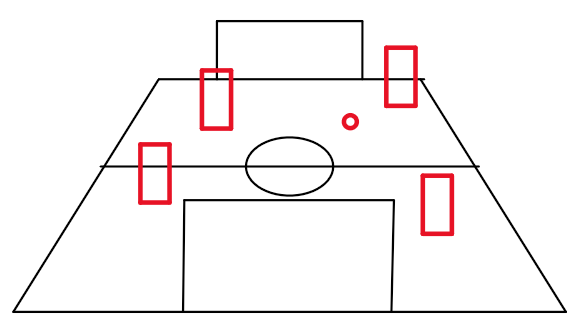

# Cooperative Autonomous Driving - Robocup Master

The goal is to detect [NAO6](https://www.aldebaran.com/en/support/nao-6) robots inside a soccer field.

For that we use [YOLOv8](https://github.com/ultralytics/ultralytics) to detect those within a python 3.9 environment.

We use one cameras on each side so calculate the positions for that.

Right now we use [robocup spl Computer Vision Project](https://universe.roboflow.com/bad-trip-cz9ej/robocup-spl) by `Bad Trip` as a starting point for robot regocnition which works pretty well.

We will serve a websocket server for the team server to connect to where we will publish the following object:

```json
{
    "state": "string",
    "time_remaining": "number",
    "robots": [
        {
            "x": "number",
            "y": "number",
            "id": "UUID",
            "angle": "number"
        }
    ],
    "ball": [
        {
            "x": "number",
            "y": "number",
        }   
    ]
}
```

The `state` can be one of the following: `playing`, `paused`, `foul`, `ended`.

The `time_remaining` is an integer of the remaining seconds to play.

## Übersicht Spielfeld


## Exemplarische Ansicht der Kamera



